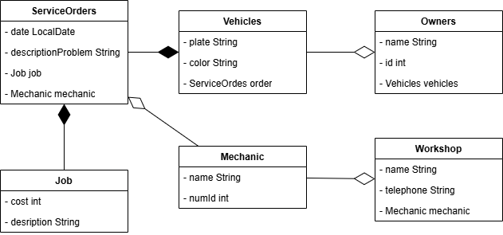

# Automotive Workshop

## Class

### Vehicles
- plate
- color

### Owners
- name
- id

### ServiceOrders
- date
- descriptionProblem

### Mechanic
- name
- numberIdentification

### Workshop
- name
- telephone

### Job
- cost
- description

## Relationships

### Composition
ServiceOrders - Job

Vehicles - ServiceOrders

### Aggregation
ServiceOrders - Mechanic

Workshop - Mechanic

Owners - Vehicles

## UML

