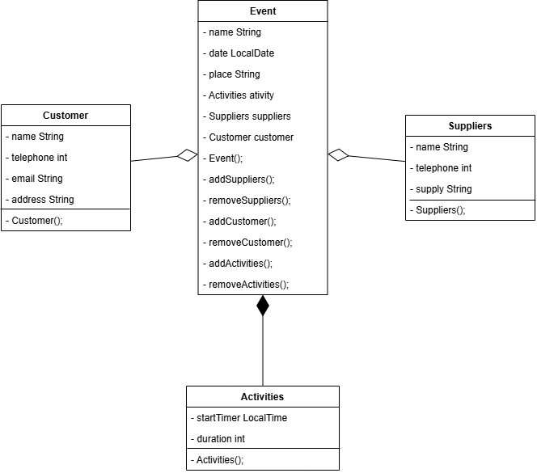

# Event Company

## Class

### Event
- name
- date
- place
  
### Customer
- name
- telephone
- email
- address

### Suppliers
- name
- telephone
- supply

### Activities
- startTime
- duration

## Relationships

### Composition
Event - Activities

### Aggregation
Event - Customer

Event - Suplier

## UML

