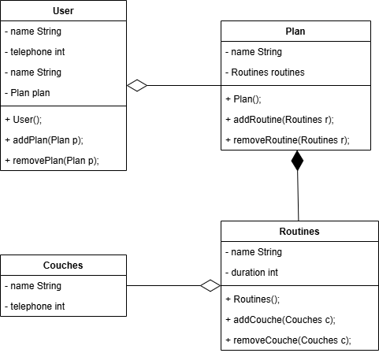

# Gym

## Class

### Coaches
- name
- telephone

### Routines
- name
- duration

### Plan
- name

### User
- name
- email
- telephone

## Relationships

### Composition
Plan - Routines

### Aggregation
User - Plan

Routines - Coaches

## UML
