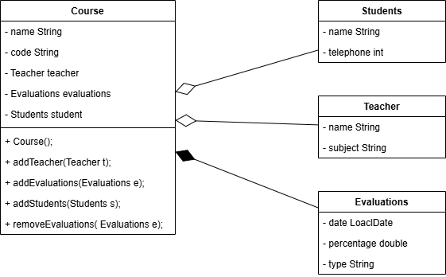

# School

## Class

### Course
- name
- code

### Students
- name
- telephone

### Teacher
- nmae
- subject

### Evaluations
- date
- percentage
- type

## Relationships

### Composition
Course - Evaluations

### Aggregation
Course - Students

Course - Teacher

## UML
