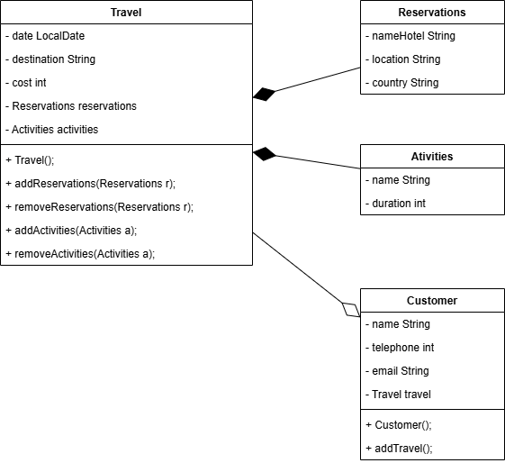

# Travel Agency

## Class

### Reservations
- nameHotel
- location
- country

### Activities
- name
- duration

### Travel
- date
- destination
- cost

### Customer
- name
- telephone
- email

## Relationships

### Composition
Travel - Reservations

Travel - Activities

### Aggregation
Customer - Travel

## UML
